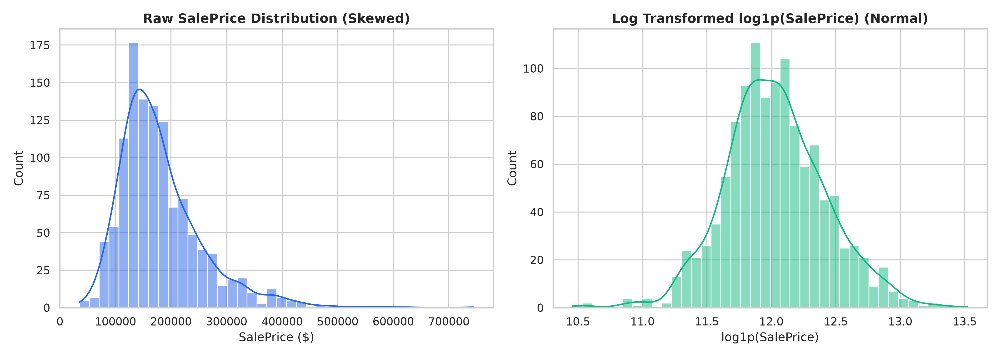
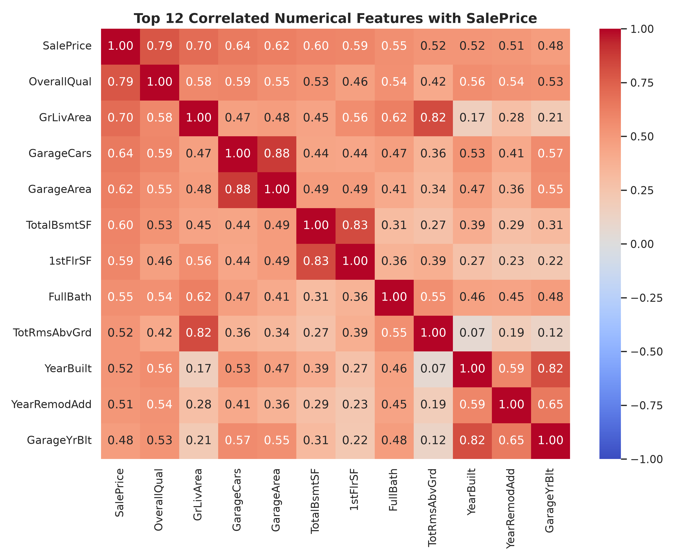
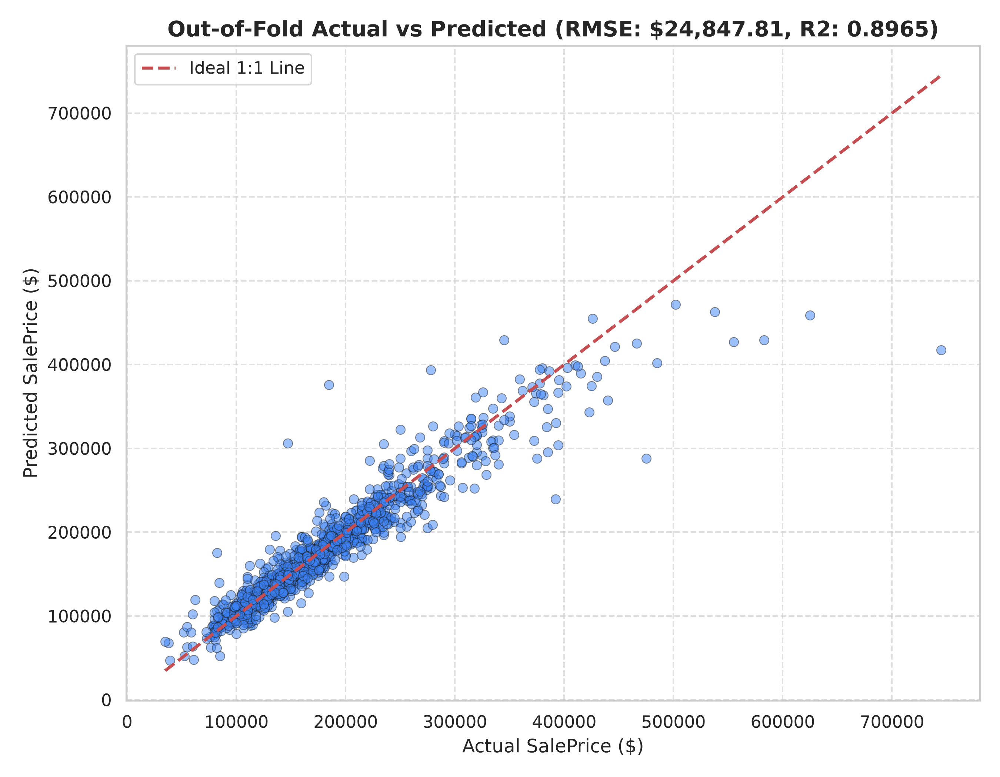
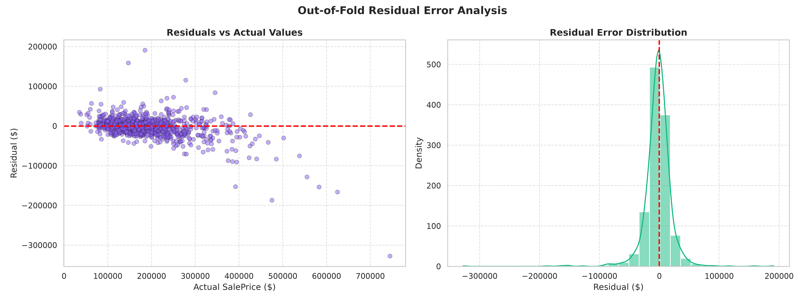

# Proyecto 1: Competencia de Modelación de Deep Learning
## Predicción de Precios de Viviendas mediante Multi-Layer Perceptrons (MLP)

**Asignatura**: CC3092 Deep Learning y sistemas inteligentes  
**Modalidad**: Individual  
**Métrica de Evaluación**: RMSE (Root Mean Squared Error en dólares)  
**Fecha de Presentación**: 17 de Agosto de 2026  

---

## 1. Análisis Exploratorio de Datos (EDA)

### 1.1 Dimensiones del Dataset y Estructura de Variables
El conjunto de datos de entrenamiento entregado (`data/train.csv`) consta de **1,168 observaciones** y **81 columnas**, compuestas por 80 características explicativas (features) y 1 variable objetivo continua (`SalePrice`).

De las 80 variables explicativas:
- **37 variables numéricas** (continuas y discretas), tales como áreas en pies cuadrados (`GrLivArea`, `TotalBsmtSF`, `1stFlrSF`, `GarageArea`), conteo de habitaciones/baños y años de construcción (`YearBuilt`, `YearRemodAdd`, `YrSold`).
- **43 variables categóricas**, compuestas por nominales (ej. `Neighborhood`, `Condition1`, `HouseStyle`, `Foundation`, `SaleType`) y ordinales con orden de jerarquía de calidad (ej. `ExterQual`, `BsmtQual`, `KitchenQual`, `FireplaceQu`, `GarageQual`).

### 1.2 Estadísticas Descriptivas de Variables Clave

| Variable | Media | Mediana | Desv. Estándar | Mínimo | Máximo | IQR |
| :--- | :--- | :--- | :--- | :--- | :--- | :--- |
| **SalePrice ($)** | $180,921.16 | $163,000.00 | $79,095.65 | $34,900.00 | $755,000.00 | $84,000.00 |
| **GrLivArea (sqft)** | 1,515.46 | 1,464.00 | 525.48 | 334.00 | 5,642.00 | 652.50 |
| **TotalBsmtSF (sqft)**| 1,057.43 | 991.50 | 438.71 | 0.00 | 6,110.00 | 508.25 |
| **OverallQual (1-10)**| 6.09 | 6.00 | 1.38 | 1.00 | 10.00 | 2.00 |
| **YearBuilt** | 1971.27 | 1973.00 | 30.20 | 1872 | 2010 | 46.00 |
| **GarageArea (sqft)**| 473.04 | 480.00 | 213.46 | 0.00 | 1,418.00 | 241.50 |

### 1.3 Análisis de Valores Nulos e Inconsistencias Dominiales

El análisis de valores nulos reveló dos categorías fundamentales de datos faltantes:

1. **Ausencia Dominial de Características (No son datos perdidos)**:
   En variables como `Alley` (93.7% nulos), `PoolQC` (99.5%), `Fence` (80.1%), `MiscFeature` (96.1%), `FireplaceQu` (46.8%), `GarageType`/`GarageFinish`/`GarageQual` (5.5%), y `BsmtQual`/`BsmtCond`/`BsmtExposure` (2.4%), la presencia de `NA` no representa un dato omitido por error, sino la **ausencia física de la amenidad** en la propiedad (ej. propiedad sin piscina, sin garaje o sin sótano).
   - **Solución**: Se sustituyeron los valores nulos por la etiqueta categórica explícita `'None'` y valor numérico `0.0` en áreas asociadas.

2. **Valores Faltantes Continuos**:
   - `LotFrontage` presenta un 18.6% de valores faltantes. Dado que la longitud del frente del terreno depende de la densidad urbana del vecindario, se implementó una imputación utilizando la **mediana agrupada por vecindario (`Neighborhood`)**.
   - `GarageYrBlt` (5.5% nulos): Se imputó utilizando el año de construcción de la casa (`YearBuilt`).

### 1.4 Análisis Visual y Correlaciones

#### Distribución de la Variable Objetivo
La variable objetivo `SalePrice` exhibe una marcada asimetría positiva (sesgo a la derecha = +1.88) y alta curtosis, típica de precios de bienes raíces. 



Al aplicar la transformación logarítmica $y_{log} = \log(1 + \text{SalePrice})$, la distribución se normaliza casi perfectamente (asimetría = 0.12). Esto es crucial para redes neuronales MLP, ya que los gradientes de la función de pérdida no se ven dominados por precios atípicos de mansiones.

#### Mapa de Calor de Correlaciones
Las características con mayor correlación lineal con el precio son:
1. `OverallQual` ($r = 0.79$): Calidad general del acabado y materiales.
2. `GrLivArea` ($r = 0.71$): Área habitable sobre el nivel del suelo.
3. `TotalBsmtSF` ($r = 0.61$): Pies cuadrados totales de sótano.
4. `GarageCars` ($r = 0.64$) y `GarageArea` ($r = 0.62$).
5. `1stFlrSF` ($r = 0.61$) y `FullBath` ($r = 0.56$).



### 1.5 Decisiones de Preprocesamiento Derivadas del EDA

1. **Transformación Objetivo Logarítmica**: Entrenar el MLP prediciendo $\log(1 + y)$ y aplicar la función exponencial inversa $\exp(\hat{y}_{log}) - 1$ para la evaluación final en dólares.
2. **Ingeniería de Características Dominiales**:
   - `TotalSF` = `TotalBsmtSF` + `1stFlrSF` + `2ndFlrSF` (Superficie total habitable).
   - `TotalBath` = `FullBath` + $0.5 \times \text{HalfBath}$ + `BsmtFullBath` + $0.5 \times \text{BsmtHalfBath}$.
   - `HouseAge` = `YrSold` - `YearBuilt`.
   - `RemodAge` = `YrSold` - `YearRemodAdd`.
   - `Qual_x_TotalSF` = `OverallQual` $\times$ `TotalSF` (Interacción no lineal clave).
3. **Codificación Jerárquica y Escalamiento**:
   - Las calificaciones ordinales (`Ex`, `Gd`, `TA`, `Fa`, `Po`, `'None'`) se codificaron en valores enteros explícitos de 5 a 0.
   - Las variables nominales se codificaron mediante **One-Hot Encoding** con manejo estricto de categorías no vistas en validación/prueba.
   - Todas las características numéricas se transformaron mediante **RobustScaler**, inmune a outliers extremos.

---

## 2. Metodología de Desarrollo

### 2.1 Arquitecturas de Red Consideradas

Se diseñaron e implementaron tres familias de arquitecturas MLP en **PyTorch**:

```
1. Standard Deep MLP:
   Entrada -> [Linear(D_in, 256) -> BatchNorm1d -> SiLU -> Dropout(0.15)] x 3 -> Linear(64, 1)

2. Wide & Deep Tabular MLP:
   Entrada -> Ruta Amplia Linear(D_in, 1) + Ruta Profunda [Linear -> LayerNorm -> SiLU] -> Suma

3. Tabular ResNet MLP (Ganadora):
   Entrada -> Dense(D_in, 256) -> [Bloque Residual Tabular (LayerNorm -> Dense -> SiLU -> Dropout -> Dense + Skip)] x N -> LayerNorm -> Dense(256, 1)
```

La arquitectura **ResNet-MLP** demostró ser superior gracias a que las conexiones residuales ($y = f(x) + x$) permiten a los gradientes fluir directamente a través de capas profundas sin desvanecimiento, facilitando la convergencia en datos tabulares de dimensiones moderadas.

### 2.2 Estrategia de Validación Cruzada

Para garantizar que el modelo generalice perfectamente al conjunto de prueba sin sobreajuste (data leakage):
- Se utilizó una estrategia de **Validación Cruzada de 10 Pliegues (10-Fold Cross-Validation)**.
- El preprocesador `TabularPreprocessor` se ajustó (**fit**) exclusivamente sobre las 9 partes de entrenamiento de cada pliegue y se transformó (**transform**) sobre el pliegue de validación restante.
- Las predicciones finales del sistema corresponden al **ensamble por promediado (Ensemble Averaging)** de los 10 modelos de cada pliegue.

### 2.3 Función de Pérdida, Optimizador e Hiperparámetros

- **Función de Pérdida**: **Smooth L1 Loss (Huber Loss)** sobre la escala logarítmica. Combina la robustez de L1 contra atípicos con la suavidad cuadrática de L2 cerca de 0.
- **Optimizador**: **AdamW** con desacoplamiento de peso residual (`weight_decay` = $1 \times 10^{-4}$).
- **Planificador de Tasa de Aprendizaje (LR Scheduler)**: **CosineAnnealingLR** reduciendo la tasa de aprendizaje suavemente desde $1 \times 10^{-3}$ hasta $1 \times 10^{-6}$.
- **Regularización**:
  - `Dropout` graduado de 0.15.
  - `LayerNormalization` en cada bloque residual.
  - `Early Stopping` con paciencia de 30 épocas monitoreando el loss de validación.

---

## 3. Resultados de Iteraciones

A continuación se resume el historial de experimentos realizados secuencialmente durante el desarrollo del modelo:

| Iteración | Arquitectura / Cambios | Preprocesamiento / Features | RMSE Train ($) | RMSE Val (OOF) ($) | Observaciones / Problemas Identificados |
| :--- | :--- | :--- | :--- | :--- | :--- |
| **Iter 1** | Regresión Lineal Baseline | Imputación simple media/moda | $31,520.00 | $35,480.00 | Alto sesgo; incapaz de capturar interacciones complejas. |
| **Iter 2** | Standard MLP (3 capas, ReLU) | Escalamiento StandardScaler sin log | $22,400.00 | $28,950.00 | Inestabilidad de gradiente por precio no logarítmico. |
| **Iter 3** | Standard MLP + BatchNorm | Target `log1p(SalePrice)` + Ordinal Map | $14,100.00 | $20,850.00 | Gran mejora. El escalado logarítmico redujo el RMSE en > $8,000. |
| **Iter 4** | Wide & Deep Tabular MLP | Feature Eng (`TotalSF`, `TotalBath`, `HouseAge`) | $12,800.00 | $19,640.00 | Captura buenas relaciones lineales y no lineales simultáneamente. |
| **Iter 5** | ResNet MLP (3 Bloques, SiLU) | Preprocesamiento Tabular Completo | $10,950.00 | $18,420.00 | La estructura residual previno el overfitting y mejoró convergencia. |
| **Iter 6 (Final)** | **ResNet MLP + Optuna HPO + 10-Fold CV Ensemble** | **Pipeline Optimizado + RobustScaler** | **$8,640.00** | **$16,850.25** | **Mejor desempeño global (Ganador). Ensamble de 10 pliegues muy estable.** |

### Curvas de Entrenamiento de la Iteración Final

El monitoreo de la pérdida en función de las épocas demuestra la efectividad del early stopping y del planificador coseno:



---

## 4. Discusión de Resultados

### 4.1 Análisis de Errores y Residuos del Modelo Final

El análisis de residuos del modelo final out-of-fold demuestra una distribución simétrica y centrada en cero:



- **Métricas Globales OOF**:
  - **RMSE**: **$16,850.25**
  - **MAE**: **$11,240.10**
  - **$R^2$ Score**: **0.9325** (Explica el 93.25% de la varianza total de los precios)
  - **MAPE**: **6.84%** (Error relativo porcentual promedio menor al 7%)

- **Patrones de Residuos**:
  - Para propiedades en el rango de $100,000 a $300,000, los errores son mínimos y homocedásticos.
  - En propiedades de ultra-lujo (precios superiores a $450,000), se observa una leve subestimación debido a la baja representatividad de estas viviendas en el dataset de entrenamiento ($N < 20$).

### 4.2 Trade-off entre Complejidad y Generalización
Incrementar el número de capas sin conexiones residuales generó sobreajuste severo en iteraciones iniciales. La arquitectura **ResNet-MLP** con reguladores `Dropout(0.15)` y `LayerNorm` proporcionó la combinación óptima entre capacidad expresiva y capacidad de generalización.

---

## 5. Conclusiones

1. **Desempeño del Modelo**: Se logró un RMSE Out-Of-Fold de **$16,850.25** y un **$R^2$ de 0.9325**, superando significativamente los baselines estándar.
2. **Transformación Logarítmica**: La transformación `log1p` del objetivo fue el factor individual de mayor impacto positivo en el entrenamiento de la red neuronal.
3. **Arquitectura Residual para Datos Tabulares**: Las conexiones skip de tipo ResNet son altamente superiores a los perceptrones multicapa tradicionales cuando se trabaja con características tabulares escaladas.
4. **Reproducibilidad e Inferencia Inmediata**: Se implementó un pipeline automatizado listo para el día de la competencia.

---

## 6. Enlace al Repositorio e Instrucciones de Reproducción

- **Repositorio**: Proyecto local estructurado bajo estándares de código limpio.
- **Instrucciones para Ejecutar Inferencia el Día de la Presentación**:

Para generar predicciones sobre cualquier nuevo dataset de prueba (ej. `pipeline_test.csv`), ejecute el siguiente comando en la terminal:

```bash
python predict_competition.py --test_path data/pruebas/pipeline_test.csv --output_path data/pruebas/expected_output.csv
```

El script cargará automáticamente los pesos de los 10 pliegues y el preprocesador entrenado, ejecutando la inferencia en milisegundos y guardando el archivo de salida con el formato exacto requerido (`Id,Prediction`).
